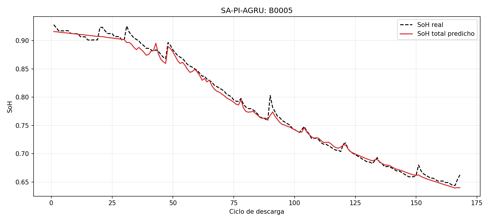
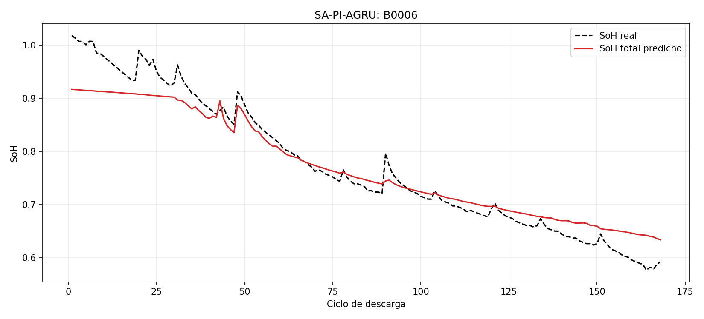
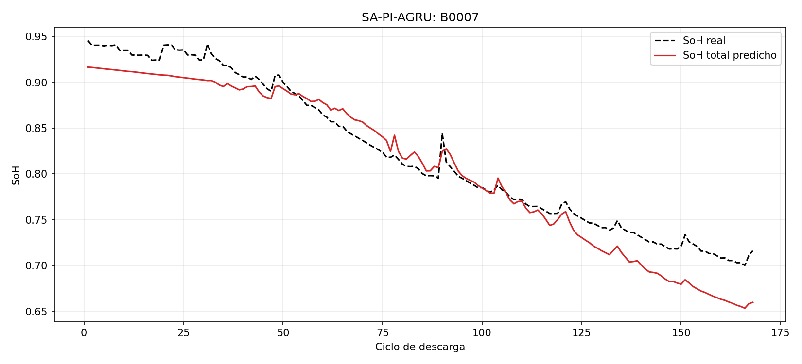

# SA-PI-AGRU: réplica y ajustes para estimar la salud de baterías

Implementación independiente basada en el artículo *A Self-Adaptive Physics-Informed
Gated Recurrent Unit Neural Networks Model for Estimating the Lifetime of Li-ion
Batteries*, de Saleh et al. (2024). El objetivo es estimar el estado de salud
de baterías de iones de litio combinando una red recurrente con atención y una
ecuación física de degradación.

[](https://doi.org/10.36227/techrxiv.171779482.20091989/v1)

La referencia utilizada es el **preprint de 2024**. Su ficha bibliográfica y el
enlace al PDF están en [referencias/](referencias/README.md). Esta réplica incorpora
los ajustes de implementación descritos más abajo y conserva cuatro scripts
para facilitar su lectura y futuras pruebas.

## Resultados principales

La ejecución de referencia se entrenó con B0005 y se aplicó a B0006 y B0007 sin
volver a entrenar el modelo. La tabla resume las curvas completas de 168 ciclos
por batería, promediando las predicciones de las ventanas de cada ciclo.
En B0005, la curva completa reúne entrenamiento, validación y prueba.

| Batería | RMSE réplica | MAE réplica | R² réplica | RMSE artículo | MAE artículo | R² artículo |
|---|---:|---:|---:|---:|---:|---:|
| B0005 | 0.7591 | 0.5665 | 99.3605 % | 0.61 | 0.39 | 99.61 % |
| B0006 | 3.4987 | 2.6697 | 92.2458 % | 1.32 | 0.92 | 98.67 % |
| B0007 | 2.4263 | 2.0259 | 90.8553 % | 1.56 | 1.18 | 96.29 % |

RMSE y MAE se expresan en puntos porcentuales de SoH: un error de 0.01 en la
escala de 0 a 1 equivale a un punto porcentual. R² describe el ajuste de la curva;
no es un porcentaje de exactitud.

Las columnas del artículo proceden de su **Tabla III, modelo propuesto**.
La comparación es orientativa: esta réplica resume una ejecución seleccionada
por ciclo, mientras que el artículo utiliza su propio protocolo experimental.
Las cifras describen el ajuste de las curvas completas y no bastan para evaluar
la predicción de ciclos futuros.

Los valores de la tabla son resultados históricos documentados. El script actual
genera las gráficas y sus CSV fuente, sin recalcular estas métricas.

### Gráficas de la ejecución de referencia



[CSV de B0005](resultados_referencia/B0005_full_cycles.csv)

<details>
<summary>Ver las curvas de B0006 y B0007</summary>



[CSV de B0006](resultados_referencia/B0006_cycles.csv)



[CSV de B0007](resultados_referencia/B0007_cycles.csv)

</details>

## Qué se conserva del artículo y qué se ajustó

Se mantiene la combinación de una GRU con atención y una pérdida física basada
en la ecuación de Verhulst. La red estima la pérdida de capacidad `u = 1 - SoH`,
donde `SoH = capacidad medida / capacidad nominal`. Se conservan tres capas
GRU de 32 unidades, dropout de 0.2, GELU en la capa densa, Adam,
10 000 épocas y 5 000 puntos para evaluar la ecuación física.

| Aspecto | Decisión en esta réplica |
|---|---|
| Preparación de datos | Separar ciclos completos antes de crear ventanas de 50 muestras, con paso 1. |
| Normalización | Ajustar mínimos y máximos únicamente con los datos de entrenamiento y reutilizarlos en las demás baterías. |
| Capacidad | Usarla solo para construir el objetivo; introducirla como sensor permitiría obtener directamente la respuesta. |
| Atención y ciclo | Usar atención por producto escalar escalado y añadir el ciclo normalizado a la representación final de la GRU. |
| Salida de la red | Utilizar una salida lineal; un Softmax aplicado a una única salida daría siempre 1. |
| Tasa de aprendizaje | Reducirla de 0.01, indicada en el artículo, a 0.001 después de las pruebas. |
| Balance de la pérdida | Usar peso físico fijo de 1, después de comparar pesos fijos y adaptativos. La versión incluida no implementa el ajuste adaptativo de pesos del artículo. |
| Ecuación física | Fijar `K = 0.5`, `C = 0.05` y tasa inicial `r = 2`; son decisiones de esta investigación. Se conserva `u(0) = 0.1`. |
| Puntos físicos | Combinar ventanas de sensores con tiempos independientes distribuidos en `[0, 1]`. |

Estos ajustes explican el alcance de la réplica: conserva la propuesta central
y deja explícitas las decisiones necesarias para disponer de un modelo ejecutable.

## Estructura

```text
Repilica-Modelo-SA-PI-AGRU/
├── README.md
├── requirements.txt
├── Scripts/
│   ├── config.py             # Parámetros y rutas
│   ├── preprocessing.py      # Conversión de los datos NASA
│   ├── model.py              # GRU, atención y parámetro físico
│   └── train.py              # Entrenamiento, gráficas y CSV
├── nasa_raw/                 # B0005, B0006, B0007 y B0018 en .mat
├── processed/                # B0005, B0006 y B0007 en .npz
├── resultados_referencia/    # Tres gráficas históricas y sus CSV
├── referencias/              # Artículo de referencia; aquí puede añadirse el PDF
└── outputs/                  # Resultados de nuevas ejecuciones
```

Los datos procesados ya están incluidos. La conversión desde los archivos
originales también forma parte del repositorio y no requiere MATLAB.
B0018 se conserva en los datos originales para posibles pruebas; no interviene
en la configuración de referencia.

## Requisitos e instalación

Use **Python 3.10 de 64 bits**. Las instrucciones siguientes están preparadas
para Windows o Linux. El proyecto utiliza PyTorch, NumPy, SciPy y Matplotlib.
Para entrenar con GPU se necesita una NVIDIA compatible y su controlador
con soporte para CUDA 11.7. También es posible ejecutar todo el entrenamiento
en CPU, aunque puede tardar bastante más.

Las pruebas se realizaron en un clúster HPC con aceleración NVIDIA L40S.
La ejecución de referencia registró Python 3.10.18, PyTorch 1.13.1,
NumPy 1.26.4, CUDA 11.7 y cuDNN 8.5. En CPU o con otras versiones pueden
aparecer diferencias numéricas; su magnitud depende del entorno y no se
garantiza que sean siempre pequeñas.

### 1. Crear un entorno

Ejecute los comandos desde la raíz del repositorio.

En Windows PowerShell:

```powershell
py -3.10 -m venv .venv
.\.venv\Scripts\Activate.ps1
python -m pip install --upgrade pip
```

En Linux:

```bash
python3.10 -m venv .venv
source .venv/bin/activate
python -m pip install --upgrade pip
```

Si PowerShell bloquea la activación, puede omitirla y usar
`.\.venv\Scripts\python.exe` en lugar de `python` en los comandos siguientes.

### 2. Instalar las dependencias

Elija una de las dos opciones.

Con GPU NVIDIA:

```bash
python -m pip install torch==1.13.1+cu117 --extra-index-url https://download.pytorch.org/whl/cu117
python -m pip install -r requirements.txt
```

Solo CPU:

```bash
python -m pip install torch==1.13.1+cpu --extra-index-url https://download.pytorch.org/whl/cpu
python -m pip install -r requirements.txt
```

Las variantes de PyTorch siguen las [instrucciones oficiales para versiones
anteriores](https://docs.pytorch.org/get-started/previous-versions/#v1131).
Las versiones de SciPy y Matplotlib de `requirements.txt` completan el entorno
propuesto; no se dispone de sus versiones exactas en el registro histórico.

Compruebe la instalación:

```bash
python -m pip check
python -c "import torch, numpy, scipy, matplotlib; print('PyTorch:', torch.__version__); print('CUDA disponible:', torch.cuda.is_available())"
```

Para la instalación de CPU es normal que la última comprobación indique `False`.

## Cómo ejecutar y reproducir el modelo base

### 1. Preparar los datos

Puede pasar al entrenamiento con los `.npz` incluidos. Para regenerarlos desde
los `.mat`, ejecute:

```bash
python Scripts/preprocessing.py
```

El comando vuelve a escribir los archivos de `processed/`. Extrae los ciclos
de descarga, aplica la limpieza, normaliza las seis señales y construye las
ventanas. Con la configuración incluida se obtienen 168 ciclos por batería;
B0005 se divide en 117 ciclos de entrenamiento, 25 de validación y 26 de prueba.

### 2. Entrenar

Con GPU:

```bash
python Scripts/train.py
```

Si solo dispone de CPU:

```bash
python Scripts/train.py --allow-cpu
```

El script muestra el avance y guarda estados del modelo y del optimizador
para poder continuar si se interrumpe. La ejecución completa consta de
10 000 épocas. Con el muestreo y tamaño de lote incluidos, cada época
realiza una actualización del optimizador.

### 3. Revisar las salidas

Al finalizar, `outputs/modelo_base/resultados/` contiene únicamente:

```text
B0005.png                 B0005_full_cycles.csv
B0006.png                 B0006_cycles.csv
B0007.png                 B0007_cycles.csv
```

Cada CSV contiene `cycle` (ciclo de descarga), `soh_true` (valor medido) y
`soh_pred` (valor predicho), con una fila por ciclo y SoH en escala de 0 a 1.
Los valores pueden superar 1 si la capacidad medida supera la nominal.

En `outputs/modelo_base/` también se guardan `checkpoint_last.pt` para reanudar,
`checkpoint_best.pt` para la menor pérdida de validación y
`checkpoint_endpoint.pt` para el estado al completar el entrenamiento.
Las tres gráficas se generan con este último estado.

Las figuras y CSV de `resultados_referencia/` conservan los resultados históricos
para consultarlos sin entrenar. El archivo de pesos de aquella ejecución no está
disponible: este repositorio permite repetir el procedimiento y sus parámetros,
pero no garantiza recuperar exactamente los mismos pesos mediante reentrenamiento.

### 4. Reanudar una ejecución interrumpida

```bash
python Scripts/train.py --resume
```

En CPU, añada `--allow-cpu`. Mantenga los mismos parámetros, datos y entorno
al reanudar. Para una prueba distinta, cambie `run_name` en `config.py`
y use una carpeta de salida nueva.

## Configuración de referencia y parámetros para hacer pruebas

Todos los parámetros se encuentran en [Scripts/config.py](Scripts/config.py).
La configuración incluida conserva los valores de la ejecución seleccionada
por su ajuste de las curvas completas.

| Grupo | Parámetro | Valor incluido y función |
|---|---|---|
| Datos | `train_battery` / `test_batteries` | B0005 / B0006 y B0007. |
| Datos | `nominal_capacity_ah` | 2.0 Ah, referencia para calcular SoH. |
| Datos | `train_fraction` / `validation_fraction` | 0.70 / 0.15; el resto se reserva para prueba, en orden de ciclos. |
| Datos | `window_size` / `stride` | 50 / 1, longitud y paso de las ventanas. |
| Datos | `drop_zero_rows` | `True`, descarta filas con señales nulas; también se excluyen valores no finitos. |
| Red | `sensor_count` | 6: voltaje, corriente, temperatura, temperatura ambiente, corriente y voltaje en la carga eléctrica durante la descarga. |
| Red | `hidden_size` / `num_layers` | 32 / 3, tamaño y profundidad de la GRU. |
| Red | `dropout` | 0.20, desactivación aleatoria durante el entrenamiento. |
| Red | `initial_r_normalized` | 2.0, valor inicial de la tasa física positiva que aprende el modelo. |
| Aprendizaje | `epochs` / `batch_size` | 10 000 / 256; se elige una ventana aleatoria por ciclo en cada época. |
| Aprendizaje | `learning_rate` / `weight_decay` | 0.001 / 0.0, para el optimizador Adam. |
| Aprendizaje | `gradient_clip_norm` | 1.0, límite de la norma del gradiente. |
| Reproducibilidad | `seed` | 58, semilla que fija la inicialización y el muestreo aleatorio. |
| Física | `carrying_capacity` / `offset` | 0.50 / 0.05, parámetros `K` y `C` de Verhulst. |
| Física | `initial_loss` | 0.10, condición inicial `u(0)`. |
| Física | `residual_weight` / `initial_condition_weight` | 1.0 / 1.0, peso físico y peso de la condición inicial. |
| Física | `collocation_points` / `collocation_time_max` | 5 000 / 1.0, número de puntos físicos y límite del tiempo normalizado. |
| Seguimiento | `validation_every` / `checkpoint_every` / `log_every` | 50 / 500 / 100 épocas. |
| Salidas | `run_name` | `modelo_base`, nombre de la carpeta de la ejecución. |

Para explorar el modelo, los cambios más directos son la tasa de aprendizaje,
el peso físico, el tamaño de la GRU, el dropout y la semilla. Si cambia las
baterías, la capacidad nominal, la limpieza, las ventanas o la división de datos, vuelva a ejecutar
`preprocessing.py`. Las seis señales forman parte del contrato de entrada;
cambiarlas requiere adaptar también su extracción.

## Pruebas realizadas y evolución de la réplica

Antes de fijar esta versión se completaron **318 entrenamientos** en cuatro
grupos de pruebas, con 3.18 millones de actualizaciones del optimizador.
La tabla resume la preparación inicial y los aspectos estudiados.

| Etapa | Qué se probó y qué aportó |
|---|---|
| Preparación de los datos | Se revisaron las ventanas por ciclo, la normalización y el uso de la capacidad para construir el objetivo. |
| Primera versión completa de la réplica | Se compararon interpretaciones de la arquitectura, salidas lineales y sigmoid, secuencias remuestreadas, uso de capacidad como control y modelos basados únicamente en datos. |
| Equilibrio entre datos y física | Se compararon ponderaciones adaptativas y fijas. El peso fijo evitó los crecimientos extremos observados en el balance adaptativo. |
| Ajuste de la tasa de aprendizaje | Se probaron tasas de 0.01 y 0.001 con pesos físicos de 0, 0.1 y 1. Se conservaron 0.001 y peso físico 1. |
| Incorporación del número de ciclo | Se comparó introducirlo dentro de la GRU o añadirlo a su representación final. Se conservó la segunda opción. |
| Condición inicial y puntos físicos | Se probaron condiciones iniciales, pares de sensores y tiempos observados o independientes, y distintos horizontes de tiempo. |
| Tendencia y variaciones locales | Se ensayó una tendencia física separada de una corrección aprendida por la red; no mejoró el ajuste conjunto de las baterías frente al modelo conservado. |
| Repeticiones y selección | Se repitieron configuraciones con distintas semillas y baterías de entrenamiento, y se revisaron estados intermedios y finales. Se conservó la ejecución con mejor ajuste de curva completa en la dirección B0005 hacia B0006 y B0007. |

Las pruebas se ejecutaron en el clúster Kabré mediante computación de alto
rendimiento (HPC), con hasta cuatro entrenamientos independientes en paralelo
y aceleración NVIDIA L40S. Cada ejecución del script incluido utiliza una GPU;
la paralelización permitió comparar más configuraciones.

## Nota sobre la implementación

Este repositorio es una réplica independiente con ajustes documentados.
No contiene ni representa el código oficial de los autores del artículo.
Los resultados principales corresponden a la ejecución de referencia descrita
aquí; cambiar parámetros o entorno da lugar a una nueva ejecución.
